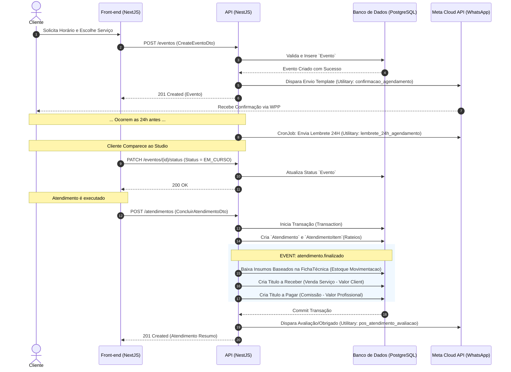

# Fluxo de Atendimento - Studio de Beleza

Este diagrama ilustra todo o processo sistêmico do momento em que um cliente realiza o agendamento até a finalização do atendimento, englobando integrações de estoque, financeiro (faturamento/rateios) e notificações WhatsApp.

## Pontos Chave Desenhados
1. A API recebe as chamadas HTTP e funciona como um maestro das filas de processos.
2. A operação pesada de fatiamento dos Atendimentos (`Rateio Financeiro` e `Bill of Materials do Estoque`) é transacional (Tudo ou Nada).
3. Todas os envios do WhatsApp seguem a nuvem oficial conectada globalmente pelo PhoneNumberId da Tenant ativa.
