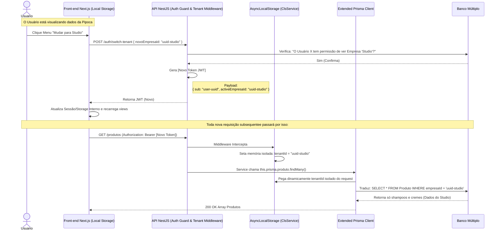

# Fluxograma de Autenticação Multi-Tenant

Sistemas como este exigem controle sobre a visibilidade dos dados via Contexto. A Empresa "Contabilmente" Mãe (Ex: Holding Flavia) detém a gerência total de permissões, enquanto o contexto isolado ("Pipoca Gourmet" ou "Studio") define qual banco/tenant está sendo consultado nas API's no momento da chamada.

Este desenho retrata a Injeção de Contexto implementada usando o `ActiveEmpresaId` injetado pelo Front-end Next.js e interceptado pelo `nestjs-cls` Middleware na API NestJS.

## Benefícios do Desenho Implementado
- **Segurança (Zero Trust Interno):** Nem o Front-end e nem o Back-end nos *Controllers* escolhem livremente as permissões ou forçam queries maliciosas. Todo WHERE da requisição do PostegreSQL injeta transparentemente a condição da sessão em todos as tabelas listadas pelo schema central.
- **Limpeza no Pipeline Front-end:** O Next.js apenas chama `fetch('/api/produtos')` sem a obrigação mecânica de gerenciar `empresaId=123` nas Query Params, evitando dezenas de bugs visuais em componentes reutilizáveis React.
