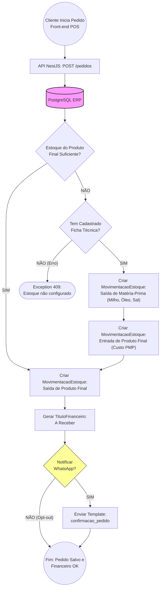

# Fluxo de Produção e Pedido - Pipoca Gourmet

Diferente do Studio de Beleza onde o serviço orienta a requisição, o braço da Pipoca Gourmet é essencialmente varejo e manufatura. Este diagrama mapeia como um Pedido deduz componentes da **Ficha Técnica (BOM)**, processa Custo Médio Ponderado e dispara para a Logística/Entrega.

## Regras Vitais Mapeadas
1. **Verificação Dinâmica (Just-in-Time):** A plataforma checa primeiramente se possui saldo direto no item pronto (ex: "Pacote 50g Pipoca Salgada"). Se houver ruptura, a API chama sua rotina interna de fábrica.
2. **Factory Method (BOM):** Ocorrendo a ausência, o sistema busca os insumos base (`Material_Prima`), deduz exatamente a quantidade da Ficha (% Milho, % Açúcar, % Óleo), valora a unidade ao custo real misturado de PMP e injeta do estoque provisoriamente para vendê-lo no mesmo segundo transacional.
3. Não havendo insumos base ou Ficha cadastrada, o sistema aplica Fail-Safe explícito aterrissando numa tela amigável no Front-end informando a gerência ("`Estoque não configurado/vazio`").
